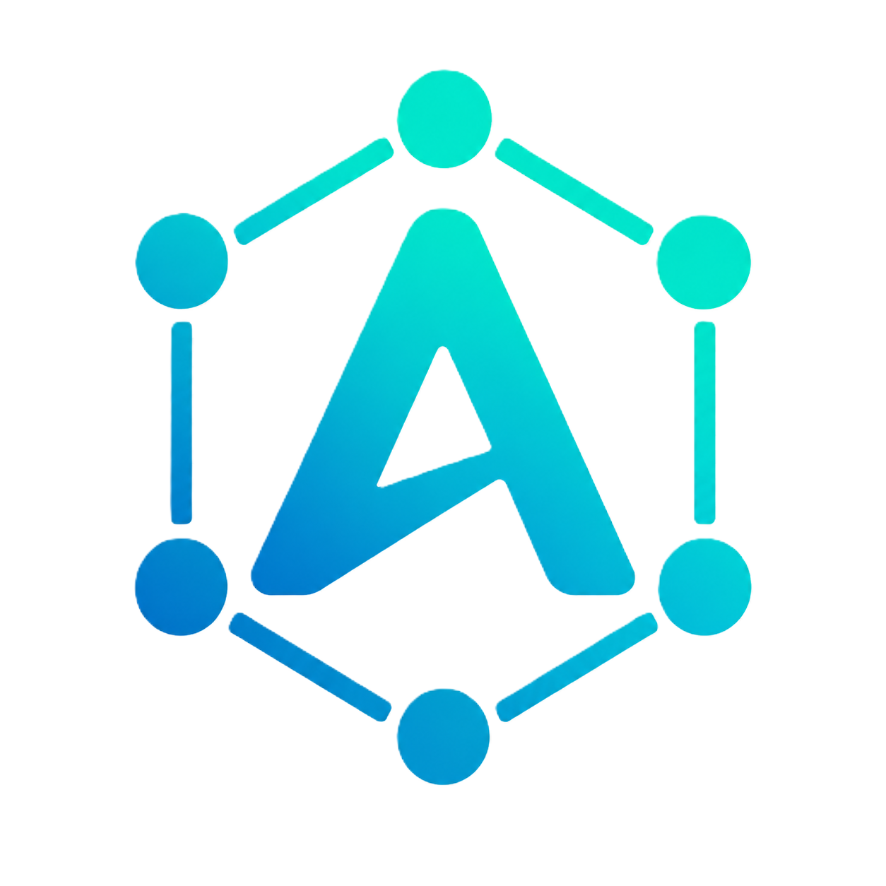

# AGILANG Native Runtime — Compatibility-First Migration Specification

> **NON-NEGOTIABLE NATIVE RULE:** The native AGILANG edition has no Python runtime, Python backend, Python training engine, Python inference engine, or Python project dependency. AGI is the backend language, AGS is the reactive frontend language, reactive JavaScript is generated only for the browser, and Rust is the native implementation substrate.



See [`docs/NATIVE_ONLY_EXECUTION_POLICY.md`](docs/NATIVE_ONLY_EXECUTION_POLICY.md).

> **Repository:** `GLOBAL-FINTECH/agilang`
> **Native workspace version:** `0.7.0`
> **Document status:** Mandatory implementation contract
> **Rule:** No native feature is considered complete until it is source-compatible, behavior-compatible, ABI-compatible, tested, and traceable to the canonical GitHub AGILANG implementation.

## 1. Purpose

This workspace is the Rust-native execution, compiler, framework, database, networking, AI, and blockchain foundation for AGILANG. The objective is not to create a second language that merely resembles AGILANG. The objective is to produce a native implementation that preserves the syntax, functions, types, framework behavior, project conventions, command-line behavior, generated applications, and observable results of the canonical AGILANG codebase.

The migration must therefore follow a **compatibility-first** strategy:

1. Freeze and inventory the canonical GitHub language surface.
2. Assign every canonical feature a stable compatibility identifier.
3. implement the feature through every required native layer.
4. run the same source fixture against the canonical and native implementations.
5. compare diagnostics, output, exit status, generated behavior, and side effects.
6. declare compatibility only after the conformance gate passes.

A Rust crate existing in this workspace is not, by itself, proof that an AGILANG program can use the capability.

---

## 2. Canonical compatibility authority

The canonical compatibility source is:

```text
https://github.com/GLOBAL-FINTECH/agilang
```

Before each native-runtime release, record:

```text
Canonical repository: GLOBAL-FINTECH/agilang
Canonical branch:      main, unless a release branch is explicitly selected
Canonical commit:      <full 40-character SHA>
Native branch:         <native integration branch>
Native commit:         <full 40-character SHA>
Compatibility schema:  AGI-COMPAT-1
```

Never document compatibility using only a branch name such as `main`. Branches move. The full canonical commit SHA must be written to:

```text
compat/canonical.lock.json
```

Required format:

```json
{
  "schema": "AGI-COMPAT-1",
  "repository": "GLOBAL-FINTECH/agilang",
  "branch": "main",
  "commit": "REPLACE_WITH_40_CHARACTER_SHA",
  "native_workspace_version": "0.7.0",
  "captured_at_utc": "REPLACE_WITH_ISO_8601_TIMESTAMP"
}
```

The native implementation must not claim “one-to-one compatibility” while this file contains placeholders.

---

## 3. Definition of one-to-one compatibility

A canonical AGILANG feature is one-to-one compatible only when all applicable layers below are complete.

| Layer | Required proof |
|---|---|
| Lexical | Identical keyword, identifier, literal, indentation, comment, and operator recognition |
| Syntax | Equivalent valid programs parse; equivalent invalid programs are rejected |
| AST | Native AST preserves the canonical construct without lossy rewriting |
| Types | Type names, inference, coercion, generics, nullability, and compatibility rules match |
| Semantics | Name resolution, scopes, mutability, control flow, ownership rules, and errors match |
| IR | Feature has an explicit typed intermediate representation |
| Code generation | Native backend emits correct executable behavior |
| Runtime ABI | Managed values and resources cross the generated-code/runtime boundary safely |
| Standard library | Canonical function/module name, parameters, return type, errors, and side effects match |
| Framework | Routes, requests, responses, middleware, auth, sessions, validation, views, and database behavior match |
| CLI | Command names, flags, defaults, exit codes, paths, and output contracts match |
| Diagnostics | Stable diagnostic code, source span, severity, and useful message exist |
| Tooling | Formatter, LSP, file extension, syntax highlighting, completion, hover, and go-to-definition understand it |
| Tests | Unit, negative, differential, integration, and cross-platform tests pass |
| Documentation | Canonical and native behavior are described with runnable examples |

A feature marked “provider complete” is not yet a language feature. It becomes a language feature only after compiler and ABI exposure are connected.

---

## 4. Mandatory migration rule

For each canonical feature, create one row in:

```text
compat/feature-matrix.csv
```

Required columns:

```text
feature_id,category,canonical_symbol,canonical_location,native_location,lexer,parser,ast,types,semantic,ir,codegen,abi,stdlib,framework,cli,lsp,tests,status,notes
```

Allowed status values:

```text
not-inventoried
specified
in-progress
provider-complete
language-complete
differential-pass
release-compatible
blocked
```

Only `release-compatible` means the feature may be advertised as one-to-one compatible.

Feature identifiers must remain stable. Examples:

```text
AGI-SYN-FUNCTION-001
AGI-SYN-RETURN-001
AGI-TYPE-I32-001
AGI-COL-ARRAY-001
AGI-WEB-AUTH-001
AGI-NET-HTTPS-001
AGI-AI-LLM-001
AGI-EVM-RPC-001
```

---

## 5. Current verified native syntax baseline

The current native compiler frontend supports a bootstrap subset containing:

- indentation-delimited function bodies;
- `fn` declarations;
- typed or untyped parameters;
- optional `-> return_type` declarations;
- `let` and `const` declarations;
- `return` statements;
- identifiers;
- integer, float, string, and Boolean literals;
- function calls;
- parentheses;
- arithmetic `+`, `-`, `*`, and `/`;
- primitive types `i32`, `i64`, `u32`, `u64`, `f32`, `f64`, `bool`, `string`, `bytes`, and `void` at the type-system level.

### 5.1 Required process entry point

The following is the canonical native executable entry point:

```agi
fn main() -> i32:
    return 0
```

Required behavior:

1. The lexer recognizes `fn`, `main`, parentheses, `->`, `i32`, `:`, indentation, `return`, and integer `0`.
2. The parser creates a function named `main` with no parameters and return type `i32`.
3. Semantic analysis verifies that every required path returns an `i32`-compatible value.
4. C code generation emits an internal `int32_t main_agi(void)` function.
5. The generated host `main(void)` calls `agilang_main()`.
6. `agilang_main()` calls `main_agi()`.
7. The operating-system process exits with status `0`.

The current C backend already contains this bridge. It must remain covered by a permanent compatibility test.

### 5.2 Entry-point contract

The compiler must reject or diagnose:

```agi
fn main() -> i32:
    return "zero"
```

```agi
fn main() -> i32:
    let result: i32 = 0
```

The second example is invalid because a non-void `main` does not return on its current control flow.

The compiler must define explicit behavior for all of these cases before release:

```agi
fn main():
    print("hello")
```

```agi
fn main() -> void:
    print("hello")
```

```agi
fn main(args: array<string>) -> i32:
    return 0
```

Until the canonical GitHub implementation is inventoried, do not assume that all three forms are valid.

---

## 6. Arrays and collections compatibility requirement

The native runtime ABI already contains persistent array and map values, but the current language parser and type model do **not** yet expose array syntax. Therefore array support is not language-compatible yet.

Array compatibility must be implemented as a vertical feature through all layers.

### 6.1 Syntax to inventory from the canonical repository

Determine the canonical spelling for each construct instead of inventing it:

```agi
let values = [1, 2, 3]
let values: array<i32> = [1, 2, 3]
let values: i32[] = [1, 2, 3]
values[0]
values[0] = 10
values.push(4)
values.length
for value in values:
    print(value)
```

The canonical codebase may support one form, several forms, or different forms. The native compiler must implement the canonical forms and may only introduce aliases through an explicitly documented compatibility layer.

### 6.2 Required array implementation layers

#### Lexer

Add and test tokens for:

- `[` and `]`;
- any generic delimiters required by the canonical type syntax;
- indexing and slicing punctuation;
- collection keywords where applicable.

#### AST

Add explicit nodes such as:

```text
ArrayLiteral
IndexExpression
IndexAssignment
SliceExpression
ArrayType
```

Do not lower arrays into generic function calls in the parser because that loses source-level semantics and weakens diagnostics.

#### Type system

Add structural collection types:

```text
Array<T>
Map<K,V>
Optional<T>
Result<T,E>
Tuple<T...>
```

Only add types confirmed by the canonical feature inventory. `Array<T>` must not be represented merely as the string name `array`.

#### Semantic analysis

Validate:

- element-type consistency;
- index integer type;
- bounds policy;
- mutability rules;
- assignment compatibility;
- empty array inference;
- nested arrays;
- array parameters and return values;
- ownership or persistent-value behavior;
- canonical method availability.

#### IR

Add typed operations for:

```text
array.new
array.length
array.get
array.set
array.push
array.remove
array.slice
array.iter
```

The exact operation set must follow canonical behavior.

#### Runtime ABI

Use opaque `AgiHandle` values for managed arrays. Required C ABI operations include construction, length, read, persistent update, append, iteration, and release. Every returned owned handle must have documented ownership.

#### Code generation

Generated code must call the versioned runtime ABI rather than embedding a second array implementation into every executable.

#### Compatibility tests

At minimum:

- empty arrays;
- one element;
- nested arrays;
- mixed-type rejection;
- index zero;
- last valid index;
- out-of-range behavior;
- immutable update behavior;
- mutable binding behavior;
- arrays passed into and returned from functions;
- arrays crossing the C ABI;
- deterministic JSON conversion;
- handle leak count returns to baseline.

---

## 7. Complete native capability requirements

The following requirements must be completed before describing the runtime as the complete native AGILANG implementation.

### 7.1 Compiler and language

- Canonical lexer coverage.
- Canonical parser coverage.
- Complete AST.
- Name resolution and module imports.
- Primitive and composite types.
- Type inference and explicit conversions.
- Conditions, loops, pattern matching, and exception/error flow.
- Classes, structs, enums, traits/interfaces, generics, modules, annotations, and visibility where canonical.
- Async functions, tasks, await, channels, cancellation, and timeouts.
- Closures and higher-order functions where canonical.
- Native package and dependency resolution.
- Deterministic build graph.
- Debug and release compilation.
- Source maps and stack traces.
- Stable diagnostics.
- C backend completion and a defined long-term backend strategy.

### 7.2 Runtime ABI

The ABI must expose versioned opaque handles for:

- strings and bytes;
- arrays, maps, tuples, and structured errors;
- tasks and cancellation tokens;
- files and streams;
- HTTP clients, requests, responses, and bodies;
- TLS configurations and certificates;
- users, credentials, sessions, and security contexts;
- database connections, statements, rows, and transactions;
- LLM clients, requests, streamed responses, tool calls, and usage;
- EVM clients, blocks, transactions, receipts, logs, contracts, and secure keys;
- ATCP contexts, envelopes, policies, signatures, and evidence.

Every ABI function requires:

- status code;
- panic containment;
- last-error JSON;
- ownership rules;
- nullability rules;
- thread-safety declaration;
- cancellation behavior;
- resource limits;
- semantic-version compatibility policy;
- C header declaration;
- unit and integration tests.

### 7.3 HTTP, HTTPS, TLS, and server runtime

The current native provider includes an outbound HTTP/1.1 and HTTP/2 client using rustls. Completion requires:

- bounded async HTTP server;
- HTTPS termination with rustls;
- HTTP/2 server support;
- request-line, header, body, and multipart limits;
- connection quotas and keep-alive policy;
- read, write, idle, and total timeouts;
- graceful shutdown;
- WebSocket upgrades and frame limits;
- streaming request and response bodies;
- compression policy;
- reverse-proxy trust configuration;
- trusted host validation;
- secure defaults for redirects and HTTPS enforcement;
- certificate loading and rotation;
- optional mutual TLS;
- structured access and security logs;
- framework adapters for routes, middleware, controllers, views, files, JSON, forms, and errors;
- compiler intrinsics and `std.http`, `std.https`, `std.tls`, and `std.websocket` modules.

### 7.4 Web authentication and application security

The native authentication foundation now uses Argon2id and OS-generated random session tokens. A production authentication system still requires:

- database-backed user records;
- normalized unique identity fields;
- password policy and breached-password integration policy;
- per-account password hash metadata and rehash-on-login;
- legacy hash migration strategy;
- registration and login services;
- logout and session revocation;
- secure, `HttpOnly`, `SameSite`, HTTPS-only cookies;
- session fixation prevention;
- CSRF tokens and origin validation;
- email verification;
- password reset with short-lived single-use tokens;
- login throttling and credential-stuffing protection;
- account lockout or adaptive challenge policy;
- role and permission authorization;
- route guards and middleware;
- MFA using TOTP and recovery codes;
- WebAuthn/passkey support;
- OAuth 2.1 authorization client/server capabilities where required;
- OpenID Connect;
- audit events;
- device/session management;
- secret zeroization;
- test fixtures covering success, failure, replay, expiry, concurrency, and revocation.

Compatibility aliases may preserve canonical imports, but insecure historical behavior must not be preserved. Security corrections require migration notes and stable diagnostics.

### 7.5 LLM and AI runtime

The provider-neutral OpenAI-compatible client must be connected to AGILANG through:

- `std.llm` standard module;
- native ABI handles;
- chat and responses abstractions;
- streaming tokens/events;
- structured outputs and schema validation;
- tool/function calling;
- multimodal request types where canonical;
- retries with bounded backoff;
- timeouts and cancellation;
- endpoint and model policy;
- API-key secret handles, never plain diagnostic output;
- usage accounting;
- rate limiting and concurrency quotas;
- provider error normalization;
- local-provider support;
- Cloudflare Workers AI/OpenAI-compatible endpoint support;
- deterministic mocks for tests;
- ATCP authorization and audit integration where enabled.

### 7.6 EVM and Smart Chain runtime

The current provider supports generic JSON-RPC requests, chain ID, and block height. Completion requires:

- canonical EVM quantity, data, address, hash, block, transaction, receipt, and log types;
- calls, gas estimation, fee history, nonce management, and transaction lookup;
- contract ABI encoding/decoding;
- contract deployment and invocation;
- event decoding and filters;
- WebSocket subscriptions;
- receipt polling with cancellation and finality policy;
- secure key handles;
- transaction construction and signing;
- chain ID replay protection;
- no raw private-key logging;
- hardware/external signer abstraction;
- SIBAQ Chain ID `1990` profiles;
- compiler and standard modules such as `std.evm` and canonical AGILANG blockchain modules;
- embedded EVM only after engine semantics, state database, gas rules, precompiles, receipts, logs, forks, and conformance tests are specified;
- compatibility tests against canonical AGILANG EVM behavior and standard JSON-RPC fixtures.

### 7.7 Database and persistence

- Stable database interfaces.
- SQLite, PostgreSQL, MySQL, and AGI-DB adapters.
- Connection pooling.
- Transactions and savepoints.
- Prepared statements.
- Schema and migrations.
- Seeding.
- Query safety and parameter binding.
- Authentication and session repositories.
- WAL, recovery, snapshots, backup, and integrity checks.
- MVCC and scheduler correctness where applicable.
- Observable and bounded resource usage.
- Compatibility tests for canonical models, queries, migrations, and framework behavior.

### 7.8 Framework compatibility

Inventory and reproduce canonical behavior for:

- project structure;
- application bootstrapping;
- dependency container;
- configuration and environment loading;
- routing and named routes;
- controllers;
- requests and responses;
- middleware;
- authentication and authorization;
- sessions;
- validation;
- views/templates;
- database models and repositories;
- migrations and seeders;
- static files;
- error pages;
- CLI generators;
- first-user administrator policy only when explicitly configured by the application;
- redirect behavior after registration/login;
- route-not-found behavior;
- test client and application test harness.

Compatibility must include function signatures and behavior, not only matching module names.

### 7.9 ATCP and protocol capabilities

Before exposing ATCP as native language APIs, implement:

- typed context objects;
- deterministic canonical serialization;
- Ed25519 signing and verification;
- identity, authorization, trust, policy, routing, financial, agent, settlement, audit, and privacy contexts;
- nonce and replay protection;
- audience, scope, and validity-window checks;
- HTTP, WebSocket, gRPC, MQTT, QUIC, JSON-RPC, MCP, and blockchain bindings as separately tested profiles;
- policy decision interfaces;
- evidence and audit records;
- ABI and compiler exposure;
- conformance vectors.

### 7.10 Tooling and developer experience

- `.agi` file association.
- AGILANG icon registration.
- TextMate grammar and semantic tokens.
- Formatter.
- LSP diagnostics, completion, hover, signatures, references, rename, symbols, formatting, and code actions.
- VS Code extension.
- IDE-neutral language-server packaging.
- Windows installer integration.
- Linux desktop/MIME integration.
- macOS file-type integration.
- `agi new`, `agi build`, `agi run`, `agi test`, `agi fmt`, `agi check`, `agi doctor`, and canonical aliases.
- Offline install and deterministic release archives.

---

## 8. Compatibility layer architecture

The compatibility layer must be explicit and removable, not scattered throughout the compiler.

Recommended workspace structure:

```text
crates/
  agilang-compat-manifest/
  agilang-compat-syntax/
  agilang-compat-stdlib/
  agilang-compat-framework/
  agilang-compat-cli/
  agilang-compat-diagnostics/
compat/
  canonical.lock.json
  feature-matrix.csv
  aliases.toml
  fixtures/
    positive/
    negative/
    runtime/
    framework/
    evm/
    llm/
  expected/
  reports/
```

### 8.1 Alias policy

Aliases may be used to preserve old GitHub names while the native implementation uses a clearer internal name.

Example:

```toml
[[type_alias]]
canonical = "HmacSha256PasswordHasher"
native = "Argon2idPasswordHasher"
reason = "Security correction; historical type name preserved for source compatibility"
deprecated = true
remove_after = "2.0.0"
```

Rules:

- aliases must be listed centrally;
- aliases must have tests;
- aliases must preserve source compatibility;
- aliases must not preserve insecure behavior;
- deprecation warnings require stable codes;
- removal requires a major version or an explicitly published compatibility policy.

### 8.2 Function compatibility descriptor

Every exported canonical function should have a machine-readable descriptor:

```json
{
  "feature_id": "AGI-STD-HTTP-GET-001",
  "canonical_name": "http.get",
  "parameters": [
    {"name": "url", "type": "string", "required": true}
  ],
  "return_type": "Result<Response,HttpError>",
  "async": true,
  "side_effects": ["network"],
  "native_intrinsic": "agi_http_get_v1",
  "compatibility": "pending"
}
```

This descriptor should generate or validate:

- standard-library declarations;
- ABI declarations;
- compiler intrinsic registration;
- documentation signatures;
- LSP signatures;
- conformance test skeletons.

---

## 9. Differential conformance testing

One-to-one compatibility requires a differential test runner.

For each fixture:

1. run it with the pinned canonical implementation;
2. run it with the native implementation;
3. normalize nondeterministic values;
4. compare:
   - stdout;
   - stderr;
   - exit status;
   - diagnostic codes;
   - source ranges;
   - generated files;
   - HTTP status/headers/body;
   - database rows and transaction outcome;
   - EVM JSON-RPC requests and normalized responses;
   - LLM mock requests and normalized responses;
   - resource-leak counters.

Required fixture metadata:

```yaml
id: AGI-SYN-FUNCTION-001-main-i32-return-zero
feature: AGI-SYN-FUNCTION-001
source: main_i32_return_zero.agi
canonical_exit: 0
native_exit: 0
stdout: ""
stderr: ""
platforms: [windows-x86_64, linux-x86_64, macos-aarch64]
```

### 9.1 Permanent entry-point fixture

Create:

```text
compat/fixtures/positive/main_i32_return_zero.agi
```

with:

```agi
fn main() -> i32:
    return 0
```

Acceptance conditions:

- lex succeeds;
- parse succeeds;
- semantic analysis succeeds;
- generated C contains `int32_t main_agi(`;
- generated C contains `return 0;`;
- host executable exits `0`;
- no runtime handles leak;
- result is equal on all supported platforms.

### 9.2 Array fixture gate

Do not add an array fixture to the positive suite until the canonical syntax is pinned. Initially add candidate syntax to an inventory document, then select canonical fixtures after repository comparison.

---

## 10. Required implementation sequence

Follow this order to avoid building disconnected capabilities.

### Phase 0 — Repository alignment

1. Publish the complete Rust workspace to a dedicated GitHub branch.
2. Preserve history where possible.
3. Pin the canonical GitHub commit.
4. Add `compat/canonical.lock.json`.
5. Add the feature matrix.
6. Prevent CI from claiming compatibility while placeholders remain.

### Phase 1 — Language inventory

1. Enumerate canonical files, modules, functions, types, syntax, CLI commands, and framework APIs.
2. Assign feature IDs.
3. Capture positive and negative examples.
4. Record canonical outputs and diagnostics.
5. Identify aliases and security corrections.

### Phase 2 — Core language vertical slices

Implement and close one feature through lexer → parser → AST → types → semantics → IR → codegen → ABI → tests before beginning another major feature.

Recommended order:

1. entry point and primitive functions;
2. variables and constants;
3. operators and comparisons;
4. branching;
5. loops;
6. arrays and maps;
7. user-defined structures/classes;
8. modules/imports;
9. errors/results;
10. async/concurrency.

### Phase 3 — Standard library and ABI

Connect filesystem, time, process, JSON, collections, HTTP/TLS, crypto, database, LLM, EVM, and ATCP through versioned intrinsics.

### Phase 4 — Framework parity

Reproduce canonical application boot, routes, controllers, middleware, authentication, sessions, validation, views, models, migrations, and CLI scaffolding.

### Phase 5 — Differential compatibility

Run canonical/native fixtures, fix behavioral drift, and produce machine-readable reports.

### Phase 6 — Release hardening

- formatting;
- Clippy with warnings denied;
- all workspace tests;
- fuzzing for parser, HTTP, ABI, and decoders;
- dependency audit;
- license audit;
- reproducible release builds;
- Windows, Linux, and macOS packaging;
- signed checksums;
- SBOM;
- release notes with compatibility SHA.

---

## 11. Required CI gates

No merge to the native release branch unless all applicable gates pass:

```bash
cargo fmt --all --check
cargo clippy --workspace --all-targets --all-features -- -D warnings
cargo test --workspace --all-features
cargo build --workspace --all-features --release
```

Additional required jobs:

```text
compat-manifest-valid
canonical-commit-resolvable
feature-matrix-valid
positive-fixtures
negative-fixtures
differential-conformance
abi-header-check
abi-symbol-check
abi-leak-check
windows-release
linux-release
macos-release
security-audit
license-audit
sbom-generation
```

A provider crate may merge with status `provider-complete`, but release notes must not call it native AGILANG language support until `differential-pass` or `release-compatible` is reached.

---

## 12. Current capability status

| Capability | Provider | Language exposure | Compatibility status |
|---|---:|---:|---|
| `fn main() -> i32` parsing | Yes | Yes | Requires canonical differential fixture |
| `return 0` process exit bridge | Yes in C backend | Yes | Requires compiled executable test |
| Primitive numeric/string/bool literals | Partial | Partial | Inventory and differential tests required |
| Arithmetic | Partial | Partial | Only bootstrap operators currently parsed |
| Arrays | Runtime value exists | No parser/type exposure | Not compatible |
| Maps | Runtime value exists | No parser/type exposure | Not compatible |
| Argon2id password hashing | Yes | Framework provider | ABI/compiler pending |
| Random session tokens | Yes | Framework provider | Persistence/security workflows pending |
| HTTP/1.1 client | Yes | Rust provider | ABI/compiler pending |
| HTTP/2 client | Yes | Rust provider | ABI/compiler pending |
| TLS certificate validation | Yes | Rust provider | ABI/compiler pending |
| HTTPS server | No | Existing server must be replaced/upgraded | Not complete |
| LLM chat client | Yes | Rust provider | ABI/compiler/streaming pending |
| EVM JSON-RPC | Yes | Rust provider | ABI/compiler/signing/subscriptions pending |
| Database stack | Many crates present | Must be validated end-to-end | Compatibility unproven |
| Framework authentication | Partial | Rust framework | Production flows pending |
| LSP | Crate present | Must be validated against complete syntax | Partial |
| ATCP | Not integrated as native language surface | Pending | Not complete |

---

## 13. Build and inspection commands

```bash
cargo fmt --all --check
cargo clippy --workspace --all-targets --all-features -- -D warnings
cargo test --workspace --all-features
cargo build --workspace --all-features --release
cargo run -p agilang-runtime-cli -- doctor
```

Compiler frontend inspection:

```bash
cargo run -p agilang-native-cli -- tokens examples/native/hello.agi
cargo run -p agilang-native-cli -- ast examples/native/hello.agi
cargo run -p agilang-native-cli -- check examples/native/hello.agi
```

Expected executable source baseline:

```agi
fn main() -> i32:
    print("AGILANG native runtime")
    return 0
```

---

## 14. Security invariants

- Never use a custom fast hash for passwords.
- Never log passwords, session tokens, API keys, seed phrases, or private keys.
- Never pass Rust object layouts across the public C ABI.
- Never unwind a Rust panic across an FFI boundary.
- Never reuse a released opaque handle without generation validation.
- Never permit unlimited HTTP bodies, headers, connections, tasks, queues, or retries.
- Never enable EVM transaction signing without a secure key abstraction and explicit chain ID.
- Never treat untrusted proxy headers as authoritative without trusted-proxy configuration.
- Never silently downgrade HTTPS/TLS policy.
- Never preserve insecure canonical behavior merely for compatibility; preserve the source contract and publish a security migration.

---

## 15. Completion definition

The native runtime can be called a complete, one-to-one compatible AGILANG implementation only when:

1. the canonical commit is pinned;
2. every advertised feature exists in the compatibility matrix;
3. all language features are connected through compiler, IR, codegen, runtime, and standard library;
4. framework functions and behavior match the canonical implementation;
5. arrays and other composite types are fully implemented and tested;
6. HTTP/HTTPS/TLS, authentication, database, LLM, EVM, and ATCP capabilities are exposed to `.agi` source;
7. differential tests pass;
8. the C ABI is versioned and leak-tested;
9. Windows, Linux, and macOS releases pass;
10. security, dependency, license, and packaging gates pass;
11. release artifacts record both canonical and native commit SHAs;
12. no documentation claims compatibility beyond the machine-generated report.

Until then, describe the workspace precisely as a **native migration implementation with measured compatibility**, not as a complete replacement.

---

## Handbook-aligned compatibility patch (v0.4 preparation)

This workspace now includes a machine-readable contract derived from the AGILANG 2.1 education/reference set, canonical and target fixtures, a static audit script, and AI continuation instructions.

Run:

```bash
python scripts/compat_audit.py
```

Read these files before changing compiler or runtime behavior:

- `compat/handbook-contract.json`
- `compat/handbook-feature-matrix.csv`
- `docs/AI_IMPLEMENTATION_INSTRUCTIONS.md`
- `docs/ONE_TO_ONE_COMPATIBILITY.md`

### Compatibility truth

The following is already wired in the bootstrap native compiler:

```agi
fn main() -> i32:
    return 0
```

The collection, full control-flow, include/module, AGS, full authentication, and language-binding fixtures under `compat/fixtures/target/` are **acceptance targets**, not claims that the current compiler executes them. This distinction is intentional: the native runtime must not advertise one-to-one parity until differential tests pass against a pinned canonical Git commit.


## Standalone native AI computation

`agilang-runtime-compute` provides a Python-free and WASM-free native CPU
backend. `agilang-runtime-abi` exposes tensor and trainable linear-model handles
for Node.js N-API addons, C/C++, Rust, and other FFI consumers. Consumers must
release tensor/model handles explicitly. Run `scripts/verify-zero-python.sh` to
enforce the production dependency boundary.


## Version 0.7.0 closure

The runtime now includes resource-aware RAM/SSD computation planning, native WebSocket transport, built-in WebRTC signaling, feature-gated STUN/TURN provider integration, safe AGS hydration state parsing, and resource/WebRTC capability ABI functions. See `docs/GENERAL_PURPOSE_LANGUAGE_CLOSURE.md`.
